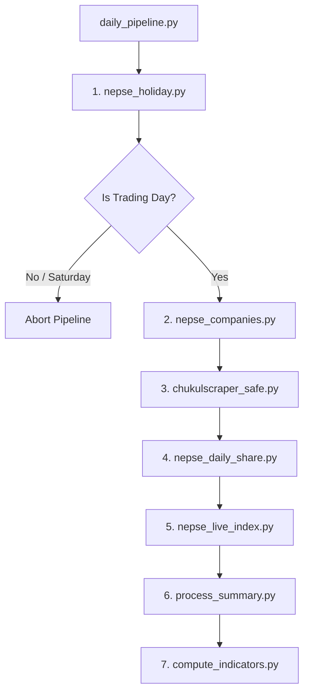

# Standalone NEPSE Daily Scraper Pipeline

This directory (`pythonserver/`) is a fully self-contained Python workspace designed to run on a remote server that has **only Python installed** (no PHP, local WebServer, or PostgreSQL required). 

All scraped data is directly saved to a remote PostgreSQL database configured via a local `config.ini` file.

---

## Folder Structure

```text
pythonserver/
├── config.ini              ← Remote database credentials (gitignored)
├── config.ini.example      ← Template database credentials file
├── db_config.py            ← Reads credentials from local config.ini
├── requirements.txt        ← All required Python packages (no Selenium/Chrome)
├── daily_pipeline.py       ← Master orchestrator script
├── fix_db_constraints.py   ← DB optimizer (adds UNIQUE constraints & cleans duplicates)
├── setup.sh                ← One-click initial server environment builder
├── deploy.sh               ← Code deployment helper (git pull + pip refresh)
├── README.md               ← General setup guide
├── PIPELINE.md             ← (This file) Pipeline architectural documentation
└── *.py                    ← Scraper files (holiday, companies, floorsheet, price, index, indicators)
```

---

## Scraper Sequence

The pipeline (`daily_pipeline.py`) runs **8 distinct steps** in order. If a step fails, the failure is reported to the database, and the pipeline proceeds to the next script to ensure maximum data coverage.



### Step-by-Step Overview

1. **`nepse_holiday.py`**
   - Refreshes the holiday calendar from NEPSE's API for the previous, current, and next years.
   - Saves holidays into the `calendar` table with `holiday = TRUE`.
   - Uses a randomized delay (5-10s) between yearly requests to protect rate limits.

2. **Trading Day Check**
   - Evaluates whether today is a trading day.
   - If today is **Saturday** or marked as a **holiday** in the `calendar` table, the pipeline aborts gracefully.
   - Logs a staleness warning if the most recent holiday on record is more than 30 days old.

3. **`nepse_companies.py`**
   - Syncs the company listing (symbols, status, emails, website, face value, sector etc.) directly from the NEPSE API.
   - Inserts new listings and flags status changes in `companies`.

4. **`chukulscraper_safe.py`**
   - Fetches today's floorsheet transactions (every buyer, seller, rate, and amount).
   - Inserts data into the `floorsheet` table using `ON CONFLICT DO NOTHING` on the transaction ID to prevent duplicates.

5. **`nepse_daily_share.py`**
   - Fetches the end-of-day price summary (Open, High, Low, Close, Volume, and Turnover) for all active scrips.
   - Inserts records into the `daily_price` table.

6. **`nepse_live_index.py`**
   - Fetches today's performance indexes (NEPSE Index, Banking, Finance, Hydro, etc.).
   - Inserts values into the `nepse_index` and `sub_index` tables.

7. **`process_summary.py`**
   - Aggregates raw floorsheet data to calculate broker net positioning (buying/selling volumes per broker).
   - populates the `daily_broker_summary` table.

8. **`compute_indicators.py`**
   - Processes price history to calculate technical indicators (RSI, MACD, EMAs, SMAs, Bollinger Bands, ATR, Stochastic Oscillator).
   - Inserts indicators into `computed_indicators`.

---

## Database Tracking Schema

The pipeline logs its progress and failures to the PostgreSQL database in two places:

### 1. `calendar` table status
The following columns are updated in the `calendar` table for today's date:
- `pipeline_run` (boolean): `TRUE` once started.
- `pipeline_status` (varchar): `'holiday'`, `'success'`, `'partial'`, or `'failed'`.
- `pipeline_ran_at` (timestamp): The execution completion time.
- `pipeline_failed_steps` (text): Comma-separated list of scripts that errored out.

### 2. `system_notifications` table logs
Each scraper step writes its result directly to the `system_notifications` table:
```sql
CREATE TABLE IF NOT EXISTS system_notifications (
    id SERIAL PRIMARY KEY,
    type VARCHAR(30) NOT NULL DEFAULT 'info', -- 'success', 'warning', 'error', 'scraper'
    title VARCHAR(255) NOT NULL,
    message TEXT,
    source VARCHAR(100), -- 'daily_pipeline.py'
    is_read BOOLEAN DEFAULT FALSE,
    created_at TIMESTAMP DEFAULT CURRENT_TIMESTAMP
);
```

---

## Automated Scheduling

### Linux Crontab (Production)
Run every day at **3:30 PM Nepal Time (09:45 AM UTC)**:
```cron
45 9 * * * cd /home/ubuntu/nepse/pythonserver && ./.venv/bin/python daily_pipeline.py 2>&1 | tee -a pipeline.log > current_scrape.log
```
*Note: The pipeline automatically determines if today is a holiday/weekend and exits within 20 seconds, logging to `pipeline.log`.*

### Windows Task Scheduler (Test/Local)
To schedule a background task at 3:30 PM daily on Windows, run the provided batch file:
```cmd
setup_task.bat
```

---

## Database Optimizer (`fix_db_constraints.py`)

If you are deploying this pipeline onto a new PostgreSQL database instance, it might lack the unique keys required for `ON CONFLICT` statements. 

Run:
```bash
.venv/bin/python fix_db_constraints.py
```
This utility:
1. Deduplicates tables using `ctid` physical references.
2. Applies `UNIQUE` constraints to:
   - `calendar(date)`
   - `daily_price(date, symbol)`
   - `nepse_index(date, index_name)`
   - `sub_index(date, index_name)`
   - `computed_indicators(date, symbol)`
   - `companies(symbol)`
   - `floorsheet(contract_no)`
